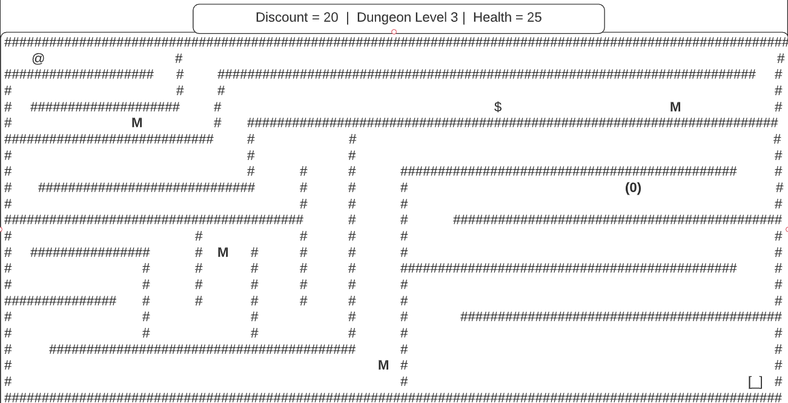

# coupon-rogue-front

# README

# Project Description
`Coupon Rogue` is a full stack project using Ruby/Ruby on Rails and Vue.js to build a browser Roguelike game. 
In this game, you play as a character who uses coupons to defeat grocery monsters by reducing their health through reducing their cost. In this game, you can level up by defeating monsters, get powerups through coupons and found items, and try to get as far as you can before the monsters defeat you. 
The player will sign up with their email and a password, then be able to create a character or resume a game with a non-deceased character. 

You will guide your `@` character through randomly generated levels, finding `$` treasures and encountering `M` monsters. The exit will show up once the level's boss `(0)` is defeated, allowing you to access the next level to delve deeper into the dungeon. 



The wireframe for the web application can be [viewed and commented on here](https://app.lucidchart.com/invitations/accept/1ebd0ae7-f540-4bc9-b1dd-8aac284a5e28).

# What is a Roguelike Game?
In 1980, the game [Rogue](https://en.wikipedia.org/wiki/Roguelike) became one of the first of its kind: a dungeon crawler game with procedurally generated levels, turn based gameplay, tile-based graphics, and permanent death of the player character.
Today many games such as Angband, Moria, and even Diablo have followed this pattern and so too will `Coupon Rogue`!

`Coupon Rogue` follows this pattern by having randomly generated levels (within certain parameters, we can't have levels without an exit or no walls), monster encounters with turn based gameplay, and no revives. The goal of the game is to see how many levels your character can get through before the monsters defeat you. 

# Back End To-Do
(Front End To Do is in the `/couponrogue-front` [directory](./couponrogue-front/README.md))
* Figure out which DB hosting service to use
* Figure out how to hook up DB
* Figure out where it'll be hosted and purchase URL
* Slim down back end logic to only handle character and user state. Game state should be handled on the front end.
* Write character controller to allow for CRUD operations on characters
* Write tests for User Controller and Character Controller >.> 

# Notes for Contributors
When creating your PR, please write a description of your changes and contributions!
If you have any questions, please don't hesitate to reach out to me via Slack or email. Also, join the #coupon_rogue_full_stack channel on slack so we can collaborate!


# To Run Locally

``` 
# start rails
rails s 

# start redis
redis-server

# serve with hot reload at localhost:8080
yarn dev

```

## Project setup
```
npm install
```

### Compiles and hot-reloads for development
```
npm run serve
```

### Compiles and minifies for production
```
npm run build
```

### Lints and fixes files
```
npm run lint
```

### Customize configuration
See [Configuration Reference](https://cli.vuejs.org/config/).

### Code Sources and Influences
[Map Generator ](https://github.com/meganetaaan/vue-maze)